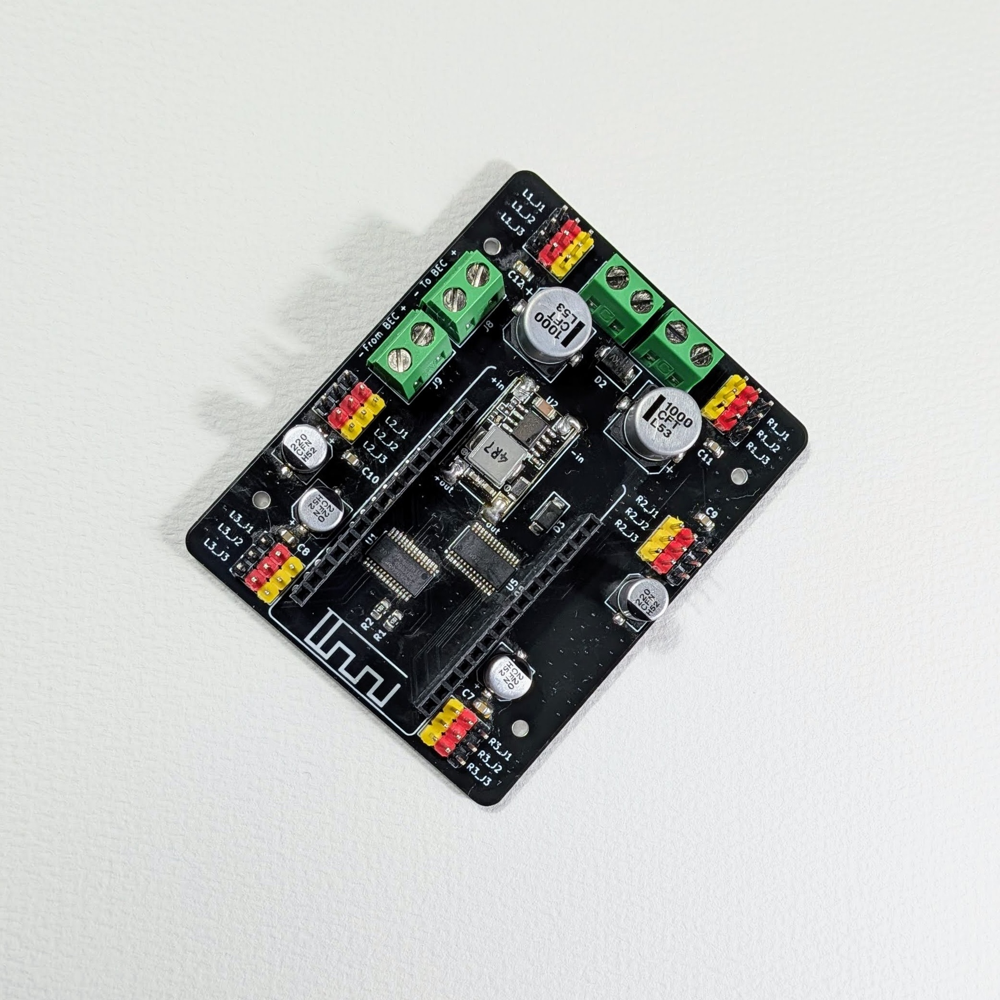
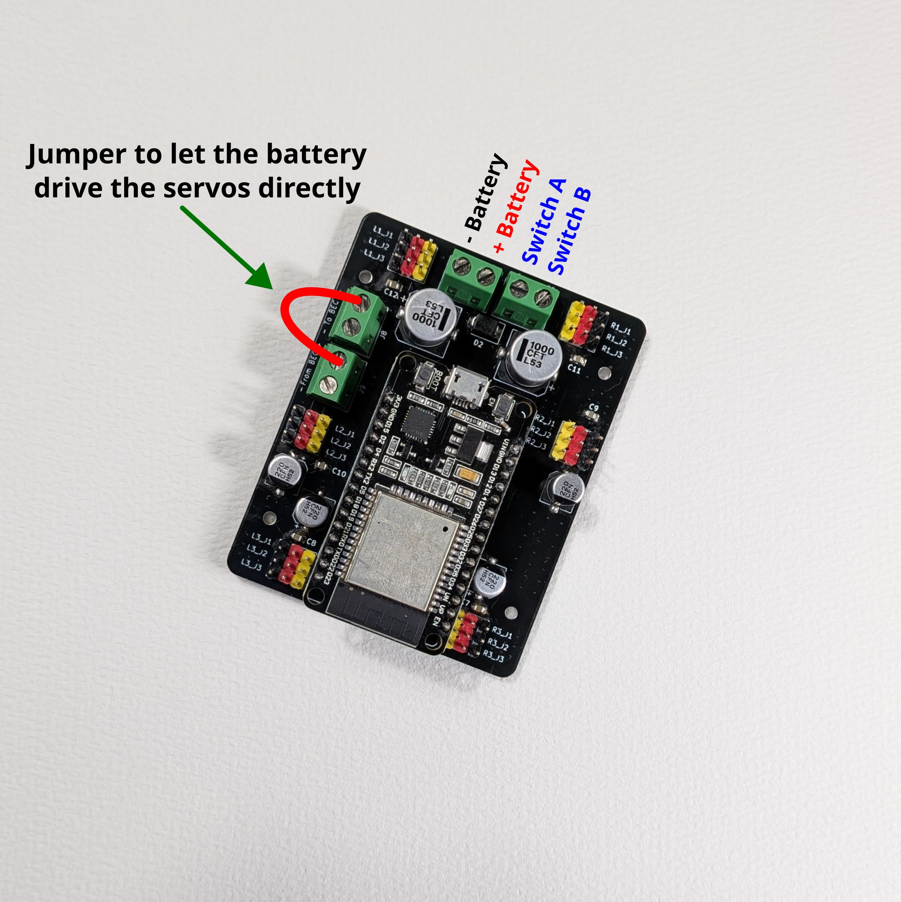
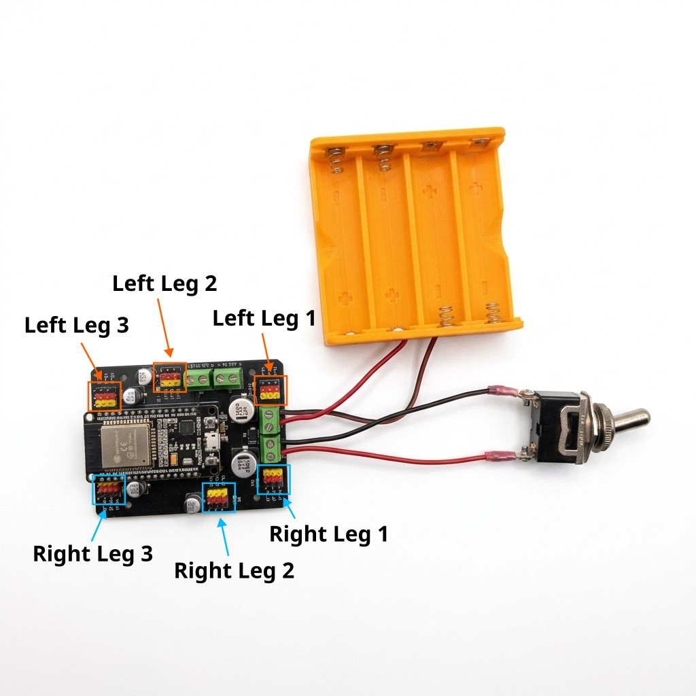
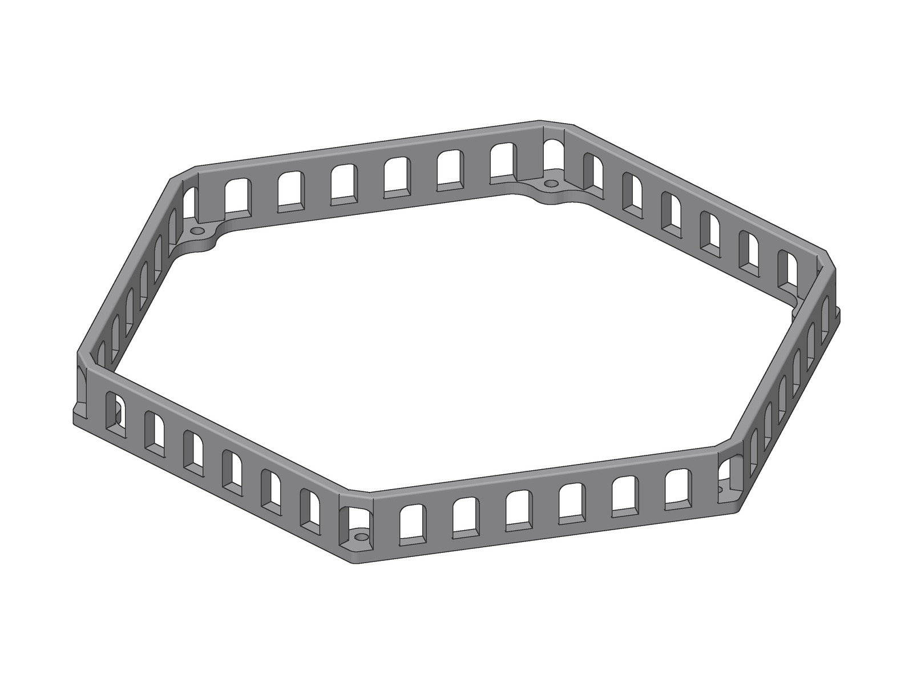

#  Hexapod Macaroon

An 18-DOF, 3D-printed hexapod robot powered by an ESP32 — walk it from your phone over WiFi, or stream poses to it live from a computer.

[](./LICENSE)
[](https://www.espressif.com/en/products/socs/esp32)
[](https://rookidroid.com/)


**Jump to:** [Bill of Materials](#bill-of-materials-bom) · [Assembly](#assembly-instructions) · [Software Setup](#software-setup) · [Control Interface](#control-interface) · [Calibration](#calibration-guide) · [Troubleshooting](#troubleshooting)

<details>
<summary><b>Table of Contents</b></summary>

- [Introduction](#introduction)
  - [Specifications](#specifications)
  - [What You'll Build](#what-youll-build)
  - [Skill Level](#skill-level)
- [Bill of Materials (BOM)](#bill-of-materials-bom)
  - [Electronics Components](#electronics-components)
  - [Connection Diagram](#connection-diagram)
- [Assembly Instructions](#assembly-instructions)
  - [Safety Notes](#safety-notes)
  - [Step 1: 3D-Printed Parts](#step-1-3d-printed-parts)
  - [Step 2: Hardware Components](#step-2-hardware-components)
- [Software Setup](#software-setup)
  - [Prerequisites](#prerequisites)
  - [Step-by-Step Installation](#step-by-step-installation)
  - [Repository Layout](#repository-layout)
  - [Project File Structure](#project-file-structure)
  - [Regenerating the Motion Tables](#regenerating-the-motion-tables)
  - [Control Interface](#control-interface)
  - [Over-The-Air (OTA) Updates](#over-the-air-ota-updates)
  - [Troubleshooting](#troubleshooting)
  - [Android App](#android-app)
  - [Desktop Control Software](#desktop-control-software)
- [Calibration Guide](#calibration-guide)
- [Related Projects](#related-projects)
- [Contributing](#contributing)
- [License](#license)
- [Support](#support)

</details>

## Introduction

This agile, 3D-printed hexapod robot is designed to work with an ESP32, providing flexibility and enhanced performance. Equipped with stronger 25kg servos, it offers a range of advanced features, including:

- **Robust, durable structure**: 3D-printed parts designed for strength and easy assembly
- **WiFi-enabled remote control**: Control your hexapod wirelessly from your smartphone or computer
- **Smooth, agile movement**: Advanced motion algorithms for natural walking patterns
- **Web-based calibration interface**: Easy servo calibration through your browser with real-time adjustment
- **Real-time pose streaming**: Drive all 18 servos live from a computer over UDP
- **Over-the-air (OTA) firmware updates**: Update firmware without cables for easy maintenance

### Specifications

| Item | Value |
| ---- | ----- |
| **Degrees of freedom** | 18 (6 legs × 3 joints: coxa, femur, tibia) |
| **Actuators** | 18 × 25 kg digital servos, 180° travel, 8.4 V capable |
| **Controller** | ESP32 with dual PCA9685 PWM drivers (I²C `0x40` / `0x41`) |
| **Power** | 4 × 18650 Li-ion in 2S2P — 7.4 V nominal, 8.4 V fully charged |
| **Connectivity** | 2.4 GHz WiFi Access Point (the robot hosts its own network) |
| **Control** | Binary UDP protocol on `192.168.4.1:1234`, plus a web UI on `http://192.168.4.1` |
| **Real-time streaming** | All 18 joints at 50 Hz, with per-joint slew limiting and a 1 s failsafe |
| **Firmware updates** | USB or over-the-air (OTA) over WiFi |
| **Resolution** | ~0.44° per servo tick (410 ticks over 180°) |

### What You'll Build

This project will guide you through building a fully functional hexapod robot with 18 degrees of freedom (3 joints per leg × 6 legs). The complete build typically takes 8-12 hours, including 3D printing, assembly, and calibration.

### Skill Level

- **Beginner-Intermediate**: Mechanical assembly skills required. No soldering is needed with the pre-assembled [Controller Board](https://rookidroid.com/product/hexapod-controller-board-macaroon-esp32/) — the servos, switch and battery holder plug straight in.
- **Tools needed**: Hex key set and a small screwdriver
- **Only if you build your own wiring harness**: soldering iron, wire cutters/strippers

## Bill of Materials (BOM)

### Electronics Components

| Name                 | Thumbnail                                                                     | Required # | Specifications                    | Note                                                                                                                                             |
| -------------------- | ----------------------------------------------------------------------------- | ---------- | --------------------------------- | ------------------------------------------------------------------------------------------------------------------------------------------------ |
| Controller Board     |  | 1          | ESP32 with dual PCA9685 drivers; servos are powered directly from the batteries | Purchase [Controller Board](https://rookidroid.com/product/hexapod-controller-board-macaroon-esp32/).                                                     |
| 25 kg Servo          |              | 18         | 180° rotation, 25 kg class        | **Support 8.4v supply voltage**. Ensure all servos are from the same batch for consistency                                                                                        |
| Toggle Switch        |                      | 1          | SPST, 12 mm diameter                |  Purchase together with the [Controller Board](https://rookidroid.com/product/hexapod-controller-board-macaroon-esp32/).                                                                                                                                                |
| 18650 Battery        |                    | 4          | 3.7V Li-ion, 2000mAh+ recommended | **Use protected batteries for safety**                                                                                                           |
| 18650 Battery Holder |      | 1          | 4-cell (2S2P) holder with wire leads | A 3D-printable holder is available [here](https://rookidroid.com/product/18650-battery-holder/), or purchase together with the [Controller Board](https://rookidroid.com/product/hexapod-controller-board-macaroon-esp32/).                                  |

### Connection Diagram





## Assembly Instructions

### Overview

Follow these steps in order for the best results:

1. **3D Print all parts** (see parts list below)
2. **Prepare hardware** (organize screws, nuts, bearings, and pins)
3. **Assemble body** (install servos and controller)
4. **Build legs** (joint → leg → foot for each leg)
5. **Attach legs to body**
6. **Wire and test** (connect servos, upload firmware, calibrate)

**⚠️ Important:** Do NOT tighten the servo horn screws during assembly! Leave them loose to allow for rotation. You'll tighten them properly during the calibration process after adjusting each servo to its correct neutral position.


### Safety Notes

- **Check battery polarity twice** before the first power-up — reversed polarity will destroy the controller board.
- **Keep fingers clear of the joints when powered.** Eighteen 25 kg servos have enough torque to pinch hard.
- **Support the robot on the first power-on.** It runs its stand-up sequence automatically as soon as a client joins its WiFi network, so hold it or stand it on a box with the legs free.
- **Treat the Li-ion pack with respect**: protected cells only, a proper 2S charger, and never charge unattended.
- If a leg moves somewhere unexpected, **cut power with the toggle switch** rather than trying to hold the leg back.

### Step 1: 3D-Printed Parts

All STL files are located in the [`3d print`](./3d%20print/) folder. Ready-to-print Bambu Studio projects (`bambu_studio_*.3mf`) are included as well.

**Print Settings Recommendations:**

- Layer height: 0.2 mm
- Infill: 20-30%
- Material: PLA or PETG for the structure, TPU for the foot tips
- Supports: Required for some parts (check STL orientation)
- Print one leg's worth of parts first and test-fit it before committing to all six

#### Step 1.1: Body Components (x1 complete body)

**Assembly Tips:**

- Install servos before closing the body
- Route wires neatly to avoid pinching
- Test fit all parts before final assembly


| Filename        | Thumbnail                                                                   | Required # |
| --------------- | --------------------------------------------------------------------------- | ---------- |
| body_base       |              | 1          |
| body_side       |              | 6          |
| body_top        |                | 1          |
| body_head       |              | 1          |
| body_battery    |        | 1          |
| body_servo_side |  | 12         |
| fence           |                      | 1 (optional) |

#### Step 1.2: Joint Components (x6 total: 3 standard + 3 mirrored)

**Important:** Pay attention to joint orientation! Three legs use standard joints, three use mirrored joints.

- **Left side legs**: Use mirrored joints
- **Right side legs**: Use standard joints

_Refer to the fully assembled robot images for correct joint orientations_


| Filename     | Thumbnail                                                             | Required # |
| ------------ | --------------------------------------------------------------------- | ---------- |
| joint_bottom |  | 12         |
| joint_cross  |    | 6          |
| joint_top    |        | 12         |

#### Step 1.3: Leg Components (x6)

**Assembly Notes:**

- Ensure bearings are properly seated
- Pins should slide in smoothly without forcing
- Check for smooth joint rotation before proceeding


| Filename   | Thumbnail                                                         | Required # |
| ---------- | ----------------------------------------------------------------- | ---------- |
| leg_bottom |  | 6          |
| leg_side   |      | 12         |
| leg_top    |        | 6          |

#### Step 1.4: Foot Components (x6 total: 3 standard + 3 mirrored)

**Important:** Match foot orientation with joint orientation!

- **Left side legs**: Use mirrored feet with mirrored joints
- **Right side legs**: Use standard feet with standard joints

_Refer to the fully assembled robot images for correct foot orientations_


| Filename    | Thumbnail                                                           | Required # | Note                        |
| ----------- | ------------------------------------------------------------------- | ---------- | --------------------------- |
| foot_bottom |  | 6          |                             |
| foot_top    |        | 6          |                             |
| foot_ground |  | 6          |                             |
| foot_tip    |        | 6          | Recommend to print with TPU |

### Step 2: Hardware Components

**Pro Tip:** Organize all hardware into labeled containers before assembly to save time!

| Name    | Spec                                  | Required # | Usage                 |
| ------- | ------------------------------------- | ---------- | --------------------- |
| Screw   | M2 × 6 mm hex socket                  | 36         | Servo mounting        |
| Screw   | M2 × 12 mm countersunk                | 180        | General assembly      |
| Nuts    | M2 hex nut                            | 216        | Securing screws       |
| Pin     | M4 × 6 mm stainless steel (304)       | 18         | Joint pivots          |
| Bearing | MR74-2RS (4 mm ID × 7 mm OD × 2.5 mm width) | 18         | Smooth joint rotation |

**Where to Buy:** These are standard metric hardware available from Amazon, AliExpress, or local hardware stores.

## Software Setup


### Prerequisites

- **Arduino IDE** (version 2.x recommended)
- **USB cable** compatible with your controller board
- **Required Libraries** (install via Arduino Library Manager):
  - `Adafruit_PWMServoDriver` (for PCA9685 control)
  - `AsyncUDP`, `ArduinoOTA`, `EEPROM` and `WebServer` (included with arduino-esp32)

### Step-by-Step Installation

1. **Install Arduino IDE** from [arduino.cc](https://www.arduino.cc/en/software)

2. **Add ESP32 Board Support**:
   - Follow the official [ESP32 Arduino installation guide](https://docs.espressif.com/projects/arduino-esp32/en/latest/installing.html)
   - Or add to Arduino IDE → File → Preferences → "Additional Board Manager URLs":

     ```
     https://raw.githubusercontent.com/espressif/arduino-esp32/gh-pages/package_esp32_index.json
     ```

   - Then install via Tools → Board → Boards Manager → Search "ESP32"

3. **Install Required Library**:
   - Go to Sketch → Include Library → Manage Libraries
   - Search for "Adafruit PWM Servo Driver"
   - Click Install

4. **Configure Board Settings**:
   - Board: "ESP32 Dev Module"
   - Upload Speed: "115200"
   - Flash Frequency: "80MHz"
   - Partition Scheme: "Default 4MB with spiffs"

5. **Open and Configure Code**:
   - Open [`./software/hexapod_esp32/hexapod_esp32.ino`](./software/hexapod_esp32/hexapod_esp32.ino)
   - Edit [`config.h`](./software/hexapod_esp32/config.h) to set your WiFi credentials (default: SSID="hexapod_macaroon", password="hexapod_1234"):

     ```cpp
     #define APSSID "hexapod_macaroon"
     #define APPSK "hexapod_1234"
     ```

   - Configure servo pin mappings if using custom wiring:

     ```cpp
     static int left_legs[3][3] = { { 1, 2, 3 }, { 5, 6, 7 }, { 9, 8, 10 } };
     static int right_legs[3][3] = { { 10, 9, 8 }, { 13, 14, 15 }, { 7, 6, 5 } };
     ```

   - Calibration offsets are set through the web interface after assembly (see Calibration section)

6. **Upload Firmware**:
   - Connect ESP32 via USB
   - Select correct COM port in Tools → Port
   - Click Upload button
   - Open Serial Monitor (115200 baud) to see the WiFi AP IP address (default: 192.168.4.1)

### Repository Layout

```text
hexapod/
├── 3d print/            # STL files, plus ready-to-print Bambu Studio projects
├── images/              # Photos, assembly animations and wiring diagrams
└── software/
    ├── hexapod_esp32/   # ESP32 firmware (Arduino sketch)
    └── path_tool/       # Python gait generator that produces motion.h
```

### Project File Structure

**ESP32 Firmware** ([`./software/hexapod_esp32/`](./software/hexapod_esp32/)):

- `hexapod_esp32.ino`: Main sketch with `setup()` / `loop()` and the shared system state
- `motion_control.ino`: PWM drivers and motion look-up table playback
- `realtime.ino`: Real-time pose streaming and its slew limiter
- `network.ino`: WiFi AP, OTA, UDP endpoint and packet parsing
- `calibration.ino`: Servo offsets loaded from / saved to EEPROM
- `web_ui.ino` / `web_page.h`: Web calibration interface
- `hexapod.h` / `protocol.h`: Shared state and UDP packet layouts
- `config.h`: WiFi credentials, servo pin mappings, and hardware settings
- `motion.h`: Pre-generated motion look-up tables for smooth walking
- [`README.md`](./software/hexapod_esp32/README.md): ESP32-specific documentation

**Path Tool** ([`./software/path_tool/`](./software/path_tool/)):

- `lut_generator.ipynb`: Jupyter notebook that builds every gait and writes `motion.h`
- `path_tool.py`: Path generators for walking, fast walking, turning, climbing, body rotations and the stand-up sequence
- `path_lib.py`: Inverse kinematics and path primitives
- `config.json`: Leg mount positions, link lengths and other robot dimensions

#### Regenerating the Motion Tables

The gaits shipped in `motion.h` are generated, not hand-written. To change one:

1. Install Python with `numpy` and Jupyter, then open `lut_generator.ipynb` from the `path_tool` folder.
2. Adjust the parameters (or add a generator in `path_tool.py`) and run all cells — the last cell writes a new `motion.h` next to the notebook.
3. Copy that `motion.h` into [`./software/hexapod_esp32/`](./software/hexapod_esp32/) and re-upload the firmware.
4. A brand-new table also needs an entry in `motion_config[]` in `motion_control.ino` — see [Adding Custom Motions](./software/hexapod_esp32/README.md#adding-custom-motions).

If you change the frame or leg dimensions, update `config.json` first: every look-up table is derived from it.

### Control Interface

#### Connection

The robot hosts its own Access Point — connect your phone or computer to it directly; it never joins your home router.

| Setting | Default | Where to change it |
| ------- | ------- | ------------------ |
| WiFi SSID | `hexapod_macaroon` | `APSSID` in `config.h` |
| WiFi password | `hexapod_1234` | `APPSK` in `config.h` |
| Robot IP | `192.168.4.1` | Fixed by the ESP32 AP |
| UDP port | `1234` | `UDP_PORT` in `config.h` |
| Web interface | `http://192.168.4.1` | — |

1. **Power on the hexapod** - connect the batteries and flip the toggle switch
2. **Join its WiFi network** - the robot runs its stand-up sequence as soon as a client connects
3. **Send commands** to `192.168.4.1:1234`, or open `http://192.168.4.1` for the calibration interface

#### Sending UDP Commands

The hexapod listens on UDP port `1234`. Three binary packet types share that port, and the **first byte selects the protocol** — the firmware dispatches on the magic number before it checks the length (the motion and session packets are both 6 bytes). All packets are little-endian and unpadded.

| Magic  | Packet          | Size | Purpose                                       |
| ------ | --------------- | ---- | --------------------------------------------- |
| `0xA5` | Motion command  | 6 B  | Play one of the built-in gait look-up tables   |
| `0xA6` | Real-time pose  | 44 B | Stream raw servo positions for all 18 joints   |
| `0xA7` | Session control | 6 B  | Enter/leave real-time mode, relax, keep-alive  |

##### Motion Commands (`0xA5`)

Byte 0 is the magic number, byte 1 the command ID, and bytes 2-5 a 32-bit sequence number.

| ID  | Action                  | Legacy text command |
| --- | ----------------------- | ------------------- |
| 0   | Stop and hold position  | `standby`           |
| 1   | Walk forward            | `walk0`             |
| 2   | Walk backward           | `walk180`           |
| 3   | Walk right at 45°       | `walkr45`           |
| 4   | Walk right at 90°       | `walkr90`           |
| 5   | Walk right at 135°      | `walkr135`          |
| 6   | Walk left at 45°        | `walkl45`           |
| 7   | Walk left at 90°        | `walkl90`           |
| 8   | Walk left at 135°       | `walkl135`          |
| 9   | Fast walk forward       | `fastforward`       |
| 10  | Fast walk backward      | `fastbackward`      |
| 11  | Turn left in place      | `turnleft`          |
| 12  | Turn right in place     | `turnright`         |
| 13  | Climbing gait forward   | `climbforward`      |
| 14  | Climbing gait backward  | `climbbackward`     |
| 15  | Body rotation — pitch   | `rotatex`           |
| 16  | Body rotation — roll    | `rotatey`           |
| 17  | Body rotation — yaw     | `rotatez`           |
| 18  | Body twist motion       | `twist`             |

**Example (Python):**

```python
import socket
import struct

# 0xA5 (magic), 1 (Walk forward), 0 (sequence number)
packet = struct.pack("<BBI", 0xA5, 1, 0)
sock = socket.socket(socket.AF_INET, socket.SOCK_DGRAM)
sock.sendto(packet, ("192.168.4.1", 1234))
```

##### Session Control (`0xA7`)

Same 6-byte layout as a motion command, with an action in byte 1:

| Action | Name  | Effect                                                 |
| ------ | ----- | ------------------------------------------------------ |
| 0      | Exit  | Leave real-time mode, resume LUT playback from standby |
| 1      | Enter | Enter real-time mode, holding the standby posture      |
| 2      | Relax | Disable both PWM drivers so the servos go limp         |
| 3      | Ping  | Keep-alive; resets the failsafe timer                  |

##### Real-Time Pose (`0xA6`)

A 44-byte packet carrying raw servo ticks for all 18 joints, which bypasses the motion look-up tables entirely. Receiving one implicitly enters real-time mode, and each joint then slews toward its target by at most `max_step` ticks per 20 ms cycle. If no packet arrives for 1 second the robot eases back to standby and returns to LUT control — send a ping while idle. Sending a motion command (`0xA5`) also leaves real-time mode, so the two control styles cannot fight over the servos.

See the [ESP32 UDP command reference](./software/hexapod_esp32/README.md#udp-command-reference) for the full field layout, tick scale, and a streaming example.

**Legacy text commands:** the firmware still falls back to parsing plain command strings (the `Legacy text command` column above) when a packet matches none of the binary layouts, e.g. `sock.sendto(b":walk0:", ...)`. The `:` delimiters are optional — leading delimiters are skipped and the command ends at the first one. New clients should use the binary protocol.

**Boot Behavior:** The robot automatically performs a boot sequence (stands up) when a client connects to its WiFi network.

### Over-The-Air (OTA) Updates

The ESP32 supports wireless firmware updates:

1. **Power on** the robot and **connect** to its WiFi network
2. In Arduino IDE, go to **Tools → Port → Network Ports**
3. Select the hexapod from network ports
4. Click **Upload** as normal

**Important Note:** OTA is disabled once the robot enters real-time mode or receives a legacy text command — binary motion commands (`0xA5`) leave it enabled. Reboot the robot to re-enable OTA.

### Troubleshooting

**Upload fails:**

- Check USB cable (must support data transfer)
- Try different USB port
- Ensure correct board and port selected
- Hold BOOT button during upload

**Servos not responding:**

- Verify battery voltage (should be 7.4V nominal for 2S Li-ion setup)
- Check all servo connections match the wiring diagram
- Verify PCA9685 I2C addresses (default: 0x40 left, 0x41 right)
- Check enable pins (GPIO 19 for left, GPIO 26 for right)
- Test individual servos using `posture_calibration()` function
- Confirm servo pin mappings in `config.h` match your wiring

**WiFi connection issues:**

- Verify SSID and password in `config.h` (default: hexapod_macaroon/hexapod_1234)
- The hexapod creates an **Access Point** - connect to it, don't look for it on your router
- Ensure your device supports 2.4GHz WiFi (5GHz not supported)
- Default IP is always `192.168.4.1` when connected to the hexapod's AP

**OTA not working:**

- OTA is turned off by real-time mode and by legacy text commands - reboot to re-enable
- Ensure you're connected to the hexapod's WiFi network
- Check firewall settings on your computer

### Android App

Control your hexapod directly from your Android smartphone:

<a href="https://play.google.com/store/apps/details?id=com.rookiedev.hexapod">
  
</a>

The app provides an intuitive interface to:

- Connect to your hexapod's WiFi network
- Control movement with on-screen buttons
- Execute all available motion commands
- Monitor connection status

**Requirements:** Android device with WiFi capability

### Desktop Control Software

The [Hexapod Link](https://github.com/rookidroid/hexapod-link) can drive the robot live through the real-time pose streaming protocol.

## Calibration Guide

Proper calibration is **critical** for smooth walking. Take your time with this step!

### Understanding Servo Positions

All servos should be at 90° (neutral position) when the legs are in the reference positions shown below.

### Calibration Procedure

The firmware includes a **web-based calibration interface** that makes the calibration process much easier - no need to repeatedly edit code and re-upload firmware!

#### Step 1: Access the Calibration Interface

1. **Upload Firmware**: Flash the code to your controller with default offset values
2. **Power On**: Connect batteries and turn on the hexapod
3. **Connect to WiFi**: Join the hexapod's WiFi network (default SSID: `hexapod_macaroon`)
4. **Open Browser**: Navigate to `http://192.168.4.1`


#### Step 2: Enter Calibration Mode

1. Click the **"Enter Calibration Mode"** button
   - The hexapod will stop motion execution
   - All current offset values will be loaded
   - A grid showing all 6 legs (18 servos) will appear

2. **Check Leg Positions**: Compare each leg with the reference images below
   - **Coxa (hip) joint**: Should be perpendicular to body
   - **Femur (thigh) joint**: Should be horizontal
   - **Tibia (shin) joint**: Should form 90° angle with femur

#### Step 3: Adjust Offsets

For each misaligned servo:

1. **Locate the servo** in the web interface:
   - Left column: Left Leg 1, 2, 3
   - Right column: Right Leg 1, 2, 3
   - Each leg has 3 joints: Joint 1 (coxa), Joint 2 (femur), Joint 3 (tibia)

2. **Adjust the offset value**:
   - Use **+** and **-** buttons for fine adjustment (±1 tick per click)
   - Or type a value directly in the input field
   - Changes apply immediately to the servo
   - 1 tick ≈ 0.44° for most servos

3. **Observe the movement** and continue adjusting until the servo reaches the correct position

#### Step 4: Save Your Calibration

1. Once all servos are properly aligned, click **"Save Offsets"**
   - Offset values are saved to **EEPROM** (persistent storage)
   - Values are also printed to Serial Monitor as backup
   - The hexapod will remember these values even after power cycles

2. **Now tighten the servo horn screws** - With each servo in its correct neutral position, firmly tighten the small screws on each servo horn to secure them in place

3. Click **"Exit Calibration Mode"** to resume normal operation

#### Step 5: Test Walking

Send a walking command to verify smooth motion. If adjustments are needed, simply re-enter calibration mode and fine-tune.

### Reference Images

**Front View**


**Top View**


### Calibration Tips

- **Use the web interface**: Much faster than editing code and re-uploading
- **Start with one leg**: Calibrate completely before moving to the next
- **Make small adjustments**: Use the +/- buttons for precise control (±1 tick per click)
- **Real-time feedback**: Servos respond immediately as you adjust values
- **Save your work**: Don't forget to click "Save Offsets" when done!
- **Check screw tightness**: Loose servo horns will affect calibration
- **Servo horn position**: If offsets exceed ±25 ticks, consider repositioning the servo horn physically

## Related Projects

| Project | What it is |
| ------- | ---------- |
| [Hexapod Link](https://github.com/rookidroid/hexapod-link) | Desktop application that drives the robot live over the real-time pose protocol |
| [Hexapod Android app](https://play.google.com/store/apps/details?id=com.rookiedev.hexapod) | Phone controller for the built-in gaits |
| [Hexapod Controller Board (Macaroon)](https://rookidroid.com/product/hexapod-controller-board-macaroon-esp32/) | The ESP32 controller board this build is designed around |
| [ESP32 firmware README](./software/hexapod_esp32/README.md) | Firmware internals and the full UDP protocol reference |

## Contributing

Issues and pull requests are welcome — bug reports, print-setting tweaks, new gaits and documentation fixes all help. A few things that make a pull request easy to merge:

- Say which hardware you tested on (servo model, board revision, firmware branch).
- Match the existing style of the Arduino sketch tabs in `software/hexapod_esp32/`.
- Regenerate `motion.h` with the path tool instead of hand-editing the look-up tables.

## License

This project is licensed under the **GNU General Public License v3.0** — see [LICENSE](./LICENSE) for the full text.

Copyright (C) 2024 - PRESENT rookidroid.com

## Support

- Website: [rookidroid.com](https://rookidroid.com/)
- Email: [info@rookidroid.com](mailto:info@rookidroid.com)
- Bugs and build questions: [GitHub Issues](https://github.com/rookidroid/hexapod/issues)
