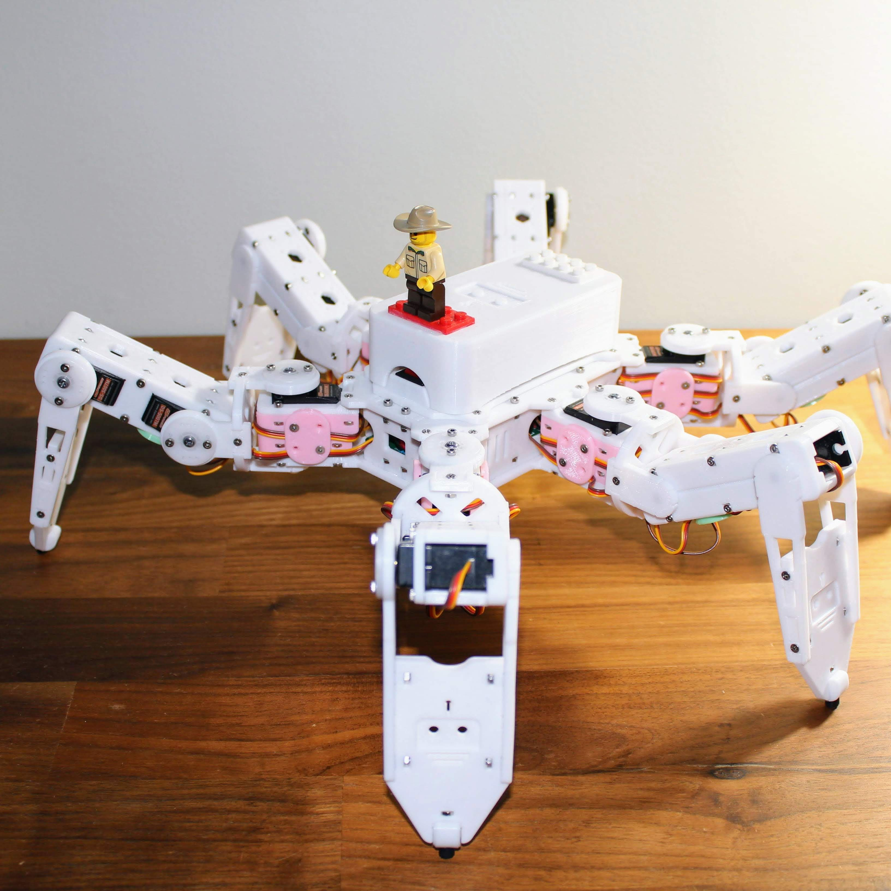
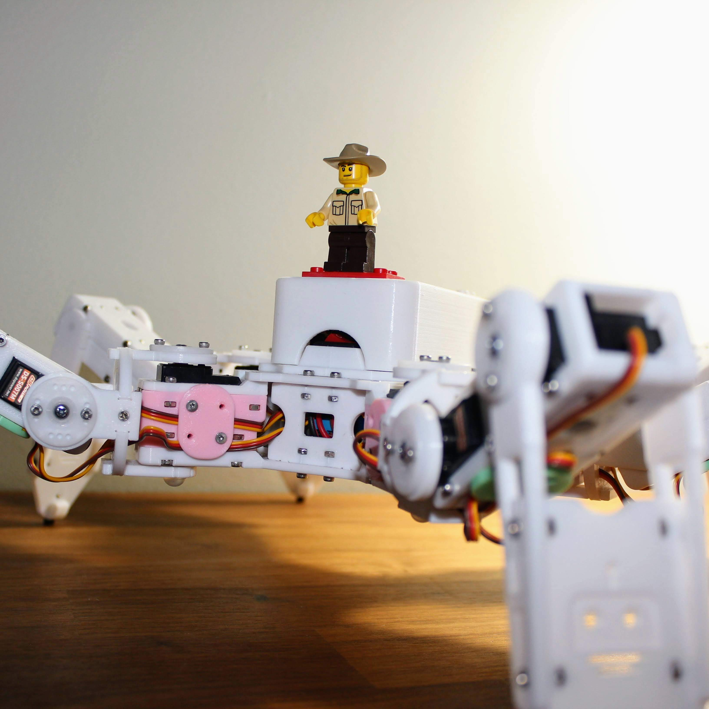
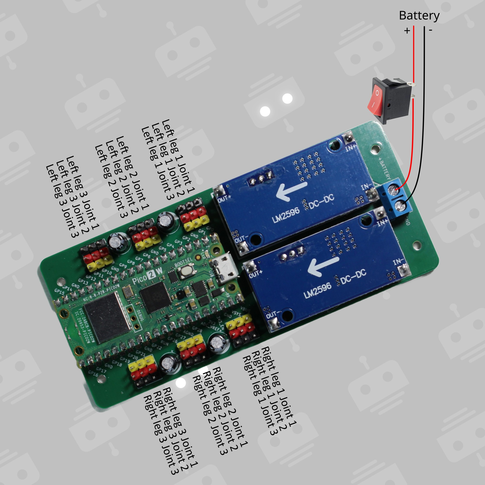

#  Hexapod

A 3D Printed Hexapod Robot

**It is strongly recommended to start with Hexapod v2 rather than building Hexapod v1. Our experience has shown that MG90S servos used in Hexapod v1 frequently fail due to their inherent weaknesses and inconsistencies in quality.**




## Introduction

This agile, 3D-printed hexapod robot is designed to work with either a Raspberry Pi PICO or an ESP32, providing flexibility and enhanced performance. Equipped with stronger and faster 21G servos, it offers a range of advanced features, including:

- **Robust, durable structure**: 3D-printed parts designed for strength and easy assembly
- **WiFi-enabled remote control**: Control your hexapod wirelessly from your smartphone or computer
- **Smooth, agile movement**: Advanced motion algorithms for natural walking patterns
- **Over-the-air (OTA) firmware updates**: Update firmware without cables for easy maintenance

### What You'll Build

This project will guide you through building a fully functional hexapod robot with 18 degrees of freedom (3 joints per leg × 6 legs). The complete build typically takes 8-12 hours, including 3D printing, assembly, and calibration.

### Skill Level

- **Beginner-Intermediate**: Basic soldering and mechanical assembly skills required
- **Tools needed**: Soldering iron, hex key set, wire cutters/strippers

## Bill of Materials (BOM)

### Electronics Components

| Name                 | Thumbnail                                                                                                                                                    | Required # | Specifications | Note                                                                                                                                                                          |
| -------------------- | ------------------------------------------------------------------------------------------------------------------------------------------------------------ | ---------- | -------------- | ----------------------------------------------------------------------------------------------------------------------------------------------------------------------------- |
| Controller Board     |  or  | 1          | ESP32 or Raspberry Pi Pico W/2W | Purchase [ESP32 version](https://rookidroid.com/product/hexapod-controller-board-esp32/) or [RPi Pico version](https://rookidroid.com/product/hexapod-controller-board-pico/). |
| 21G Servo            |                                                                                           | 18         | 21G digital servo, 180° rotation | DS Power or Miuzei 21G servo. **Ensure all servos are from the same batch for consistency**                                                                                                                                                  |
| Rocker Switch        |                                                                                                     | 1          | SPST, 6A rating minimum |                                                                                                                                                                               |
| 18650 Battery        |                                                                                                   | 2          | 3.7V Li-ion, 2000mAh+ recommended | **Use protected batteries for safety**                                                                                                                                                                               |
| 18650 Battery Holder |                                                                                      | 1          | 2-cell holder with wire leads |                                                                                                                                                                               |

### Connection Diagram

#### ESP32


#### Respberry Pi Pico W/2W



## Assembly Instructions

### Overview

Follow these steps in order for the best results:

1. **3D Print all parts** (see parts list below)
2. **Prepare hardware** (organize screws, nuts, bearings, and pins)
3. **Assemble body** (install servos and controller)
4. **Build legs** (joint → leg → foot for each leg)
5. **Attach legs to body**
6. **Wire and test** (connect servos, upload firmware, calibrate)


### Step 1: 3D-Printed Parts

**Print Settings Recommendations:**

- Layer height: 0.2mm
- Infill: 20-30%
- Material: PLA or PETG
- Supports: Required for some parts (check STL orientation)
- Print time: Approximately 30-40 hours total for all parts

#### Step 1.1: Body Components (x1 complete body)

**Assembly Tips:**

- Install servos before closing the body
- Route wires neatly to avoid pinching
- Test fit all parts before final assembly


| Filename         | Thumbnail                                                                     | Required # |
| ---------------- | ----------------------------------------------------------------------------- | ---------- |
| body_base        |                | 1          |
| body_side        |                | 6          |
| body_top         |                  | 1          |
| body_head   |      | 1          |
| body_battery_top     |          | 1          |
| body_servo_side |  | 12          |

#### Step 1.2: Joint Components (x6 total: 3 standard + 3 mirrored)

**Important:** Pay attention to joint orientation! Three legs use standard joints, three use mirrored joints.

- **Left side legs**: Use mirrored joints
- **Right side legs**: Use standard joints

_Refer to the fully assembled robot images for correct joint orientations_


| Filename     | Thumbnail                                                             | Required # | Note |
| ------------ | --------------------------------------------------------------------- | ---------- | ---- |
| joint_bottom |  | 12         |      |
| joint_cross  |    | 6          |      |
| joint_top    |        | 12         |      |

#### Step 1.3: Leg Components (x6)

**Assembly Notes:**

- Ensure bearings are properly seated
- Pins should slide in smoothly without forcing
- Check for smooth joint rotation before proceeding


| Filename   | Thumbnail                                                         | Required # |
| ---------- | ----------------------------------------------------------------- | ---------- |
| leg_bottom |  | 6          |
| leg_side   |      | 12         |
| leg_top    |        | 6          |

#### Step 1.4: Foot Components (x6 total: 3 standard + 3 mirrored)

**Important:** Match foot orientation with joint orientation!

- **Left side legs**: Use mirrored feet with mirrored joints
- **Right side legs**: Use standard feet with standard joints

_Refer to the fully assembled robot images for correct foot orientations_


| Filename    | Thumbnail                                                           | Required # | Note |
| ----------- | ------------------------------------------------------------------- | ---------- | ---- |
| foot_bottom |  | 6          |      |
| foot_top    |        | 6          |      |
| foot_ground |  | 6          |      |
| foot_tip    |        | 6          |      |

### Step 2: Hardware Components

**Pro Tip:** Organize all hardware into labeled containers before assembly to save time!

| Name      | Spec                                  | Required # | Usage                          |
| --------- | ------------------------------------- | ---------- | ------------------------------ |
| Screw     | M2 × 6mm hex socket                   | 36         | Servo mounting                 |
| Screw     | M2 × 12mm countersunk                 | 180        | General assembly               |
| Nuts      | M2 hex nut                            | 216        | Securing screws                |
| Pin       | M4 × 6mm stainless steel (304)        | 18         | Joint pivots                   |
| Bearing   | MR74-2RS (4mm ID, 7mm OD, 2.5mm Bore) | 18         | Smooth joint rotation          |

**Where to Buy:** These are standard metric hardware available from Amazon, AliExpress, or local hardware stores.

## Software Setup


### Prerequisites

- **Arduino IDE** (version 1.8.19 or later) or **PlatformIO**
- **USB cable** compatible with your controller board
- **WiFi network** (for ESP32 wireless control and OTA updates)

### Step-by-Step Installation

#### Option 1: ESP32 Setup

1. **Install Arduino IDE** from [arduino.cc](https://www.arduino.cc/en/software)

2. **Add ESP32 Board Support**:
   - Open Arduino IDE → File → Preferences
   - Add to "Additional Board Manager URLs":

     ```
     https://raw.githubusercontent.com/espressif/arduino-esp32/gh-pages/package_esp32_index.json
     ```

   - Go to Tools → Board → Boards Manager
   - Search "ESP32" and install "esp32 by Espressif Systems"

3. **Configure Board Settings**:
   - Board: "ESP32 Dev Module"
   - Upload Speed: "115200"
   - Flash Frequency: "80MHz"
   - Partition Scheme: "Default 4MB with spiffs"

4. **Open and Configure Code**:
   - Open `./software/hexapod_esp32/hexapod_esp32.ino`
   - Edit `config.h` to set your WiFi credentials:

     ```cpp
     const char* ssid = "YOUR_WIFI_SSID";
     const char* password = "YOUR_WIFI_PASSWORD";
     ```

   - Adjust servo offset values based on your assembly (see Calibration section)

5. **Upload Firmware**:
   - Connect ESP32 via USB
   - Select correct COM port in Tools → Port
   - Click Upload button
   - Wait for "Done uploading" message

#### Option 2: Raspberry Pi Pico Setup

1. **Install Arduino IDE** and **Arduino-Pico Core**:
   - Follow instructions at [arduino-pico](https://github.com/earlephilhower/arduino-pico)
   - Add board manager URL: `https://github.com/earlephilhower/arduino-pico/releases/download/global/package_rp2040_index.json`

2. **Configure Board Settings**:
   - Board: "Raspberry Pi Pico W" (or "Pico 2W")
   - Flash Size: "2MB (Sketch: 1MB, FS: 1MB)"
   - Upload Method: "Default (UF2)"

3. **Open and Configure Code**:
   - Open `./software/hexapod_pico/hexapod_pico.ino`
   - Edit `config.h` for WiFi and servo settings

4. **Upload Firmware**:
   - Hold BOOTSEL button while connecting USB
   - Release after Pico appears as mass storage device
   - Upload sketch through Arduino IDE

### Project File Structure

**ESP32 Version** (`./software/hexapod_esp32/`):

- `hexapod_esp32.ino`: Main Arduino sketch with control logic
- `config.h`: WiFi credentials, servo pin mappings, and calibration offsets
- `motion.h`: Pre-generated motion look-up tables for smooth walking
- `README.md`: ESP32-specific documentation

**Pico Version** (`./software/hexapod_pico/`):

- `hexapod_pico.ino`: Main sketch optimized for RP2040
- `config.h`: Configuration settings
- `motion.h`: Motion look-up tables
- `PicoPWM.cpp/h`: Custom PWM library for precise servo control
- `README.md`: Pico-specific documentation

**Path Tool** (`./software/path_tool/`):

- `path_tool.py`: Tool for generating custom walking patterns
- `lut_generator.ipynb`: Jupyter notebook for motion path visualization
- `path_lib.py`: Library for inverse kinematics calculations

### Control Interface

#### Web Interface (ESP32 only)

1. After uploading, open Serial Monitor (115200 baud)
2. Note the IP address displayed (e.g., `192.168.1.100`)
3. Open browser and navigate to the IP address
4. Use on-screen controls to move the hexapod

#### UDP Commands (Both ESP32 and Pico)

The hexapod accepts motion commands via UDP packets. Available commands include:

- `standby`: Stand in neutral position
- `walk0`: Walk forward
- `walk180`: Walk backward  
- `turnleft`: Rotate left in place
- `turnright`: Rotate right in place
- `fastforward`: Walk forward at faster speed
- `fastbackward`: Walk backward at faster speed
- And many more (see `motion.h` for full list)

Commands are sent via the web interface or UDP client applications.

### Troubleshooting

**Upload fails:**

- Check USB cable (must support data transfer)
- Try different USB port
- Ensure correct board and port selected
- For ESP32: Hold BOOT button during upload

**Servos not responding:**

- Verify battery voltage (should be 7.4V nominal)
- Check all servo connections match wiring diagram
- Test servos individually using calibration mode

**WiFi connection issues:**

- Verify SSID and password in config.h
- Ensure 2.4GHz WiFi (5GHz not supported)
- Check router allows new device connections

### Android App

_Work in progress - Check repository for updates_

### Desktop Control Software

_Work in progress - Check repository for updates_

## Calibration Guide

Proper calibration is **critical** for smooth walking. Take your time with this step!

### Understanding Servo Positions

All servos should be at 90° (neutral position) when the legs are in the reference positions shown below.

### Calibration Procedure

1. **Upload Firmware**: Flash the code to your controller with default offset values

2. **Enable Calibration Function** (Optional):
   - Open the `.ino` file for your controller
   - Find the commented line `// posture_calibration();` in the `setup()` function
   - Uncomment it to enable the calibration posture
   - Re-upload the firmware

3. **Power On**: Connect batteries and turn on the hexapod
   - If you enabled the calibration function, all servos will move to 90° neutral position on boot
   - Otherwise, the hexapod will boot into standby mode

4. **Check Leg Positions**: Compare each leg with the reference images below
   - **Coxa (hip) joint**: Should be perpendicular to body
   - **Femur (thigh) joint**: Should be horizontal
   - **Tibia (shin) joint**: Should form 90° angle with femur

5. **Measure Offsets**: For each misaligned servo:
   - Note which leg (L0-L2 for left, R0-R2 for right)
   - Note which joint (0=coxa, 1=femur, 2=tibia)
   - Estimate angle difference in degrees
   - Convert to ticks (1° ≈ 10 ticks for most servos)

6. **Update config.h**: Edit the offset arrays in `config.h`:

   ```c
   // Left side legs: [L0][L1][L2]
   // Each leg has [coxa, femur, tibia] offsets
   static int left_offset_ticks[3][3] = {
     {-5, 10, 0},    // L0 (left front)
     {-15, 5, -20},  // L1 (left middle)
     {20, -10, 10}   // L2 (left rear)
   };
   
   // Right side legs: [R0][R1][R2]
   static int right_offset_ticks[3][3] = {
     {20, -10, 0},   // R0 (right front)
     {-15, 0, -5},   // R1 (right middle)
     {-10, 0, -20}   // R2 (right rear)
   };
   ```

7. **Re-upload and Test**: Upload modified code and verify positions

8. **Fine-tune**: Repeat steps 2-7 until all legs match reference positions

9. **Disable Calibration Mode**: Once calibration is complete, comment out the `posture_calibration();` line again and upload final firmware

### Reference Images

**Front View - Check coxa and femur alignment:**


**Side View - Check all three joints:**


### Calibration Tips

- **Start with one leg**: Calibrate completely before moving to the next
- **Make small adjustments**: Change values by ±10-20 ticks at a time
- **Document your values**: Keep a backup of working offset values
- **Check screw tightness**: Loose servo horns will affect calibration
- **Servo horn position**: If offsets exceed ±50 ticks, consider repositioning the servo horn

### Common Calibration Issues

**Leg wobbles during walking:**

- Re-check femur and tibia joint calibration
- Ensure all mechanical connections are tight

**Hexapod tips to one side:**

- Balance the offset values between left and right legs
- Check battery placement and weight distribution

**Jerky movements:**

- Calibration likely OK - check power supply voltage
- Verify servo horn screws are fully tightened
