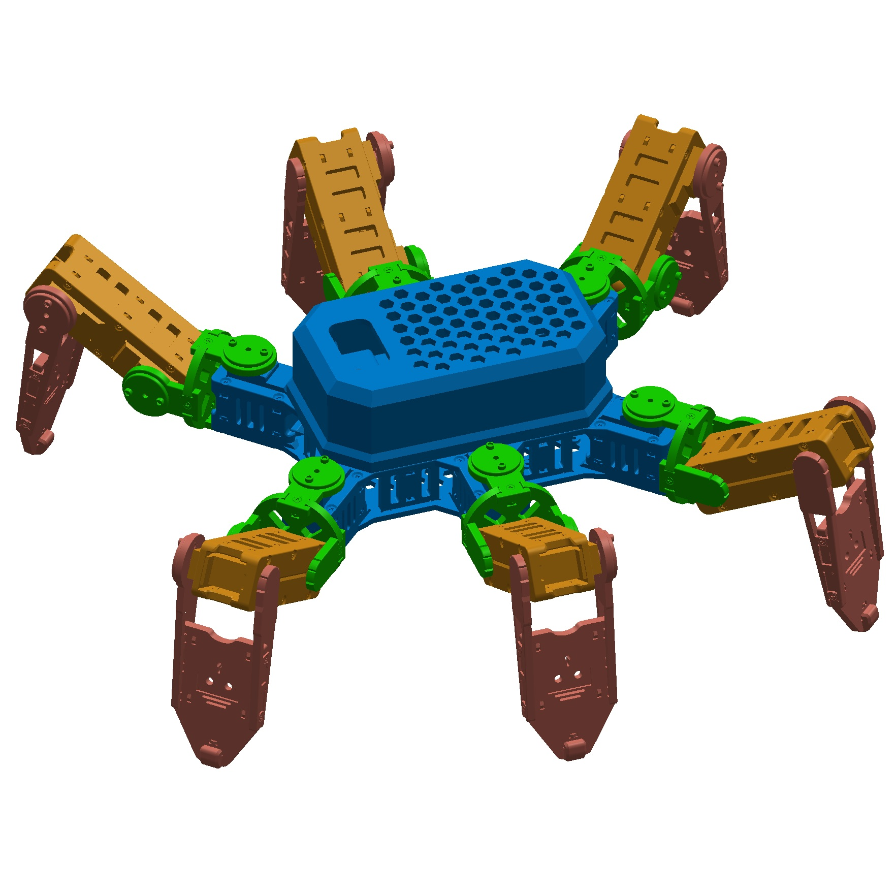
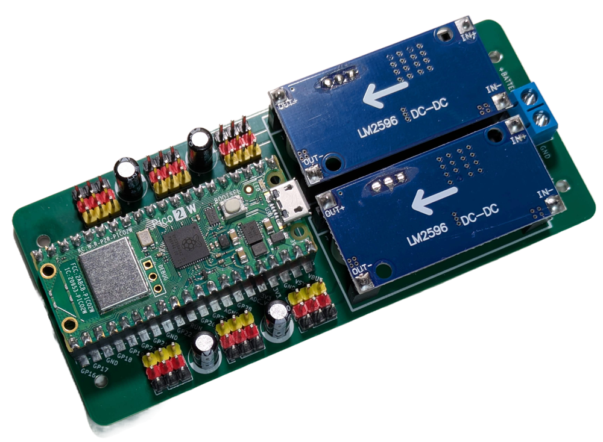
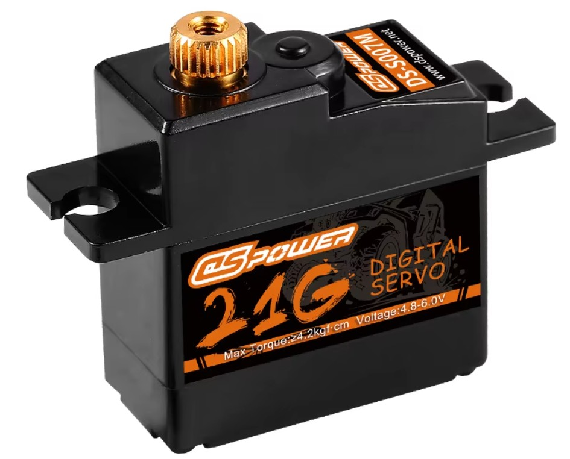
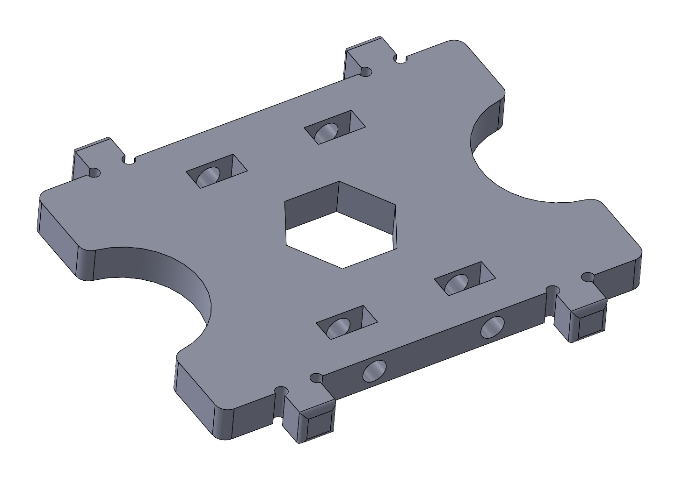
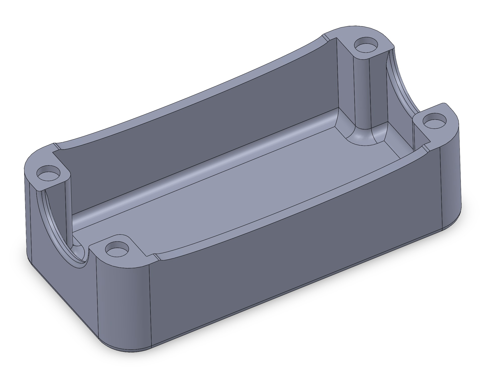
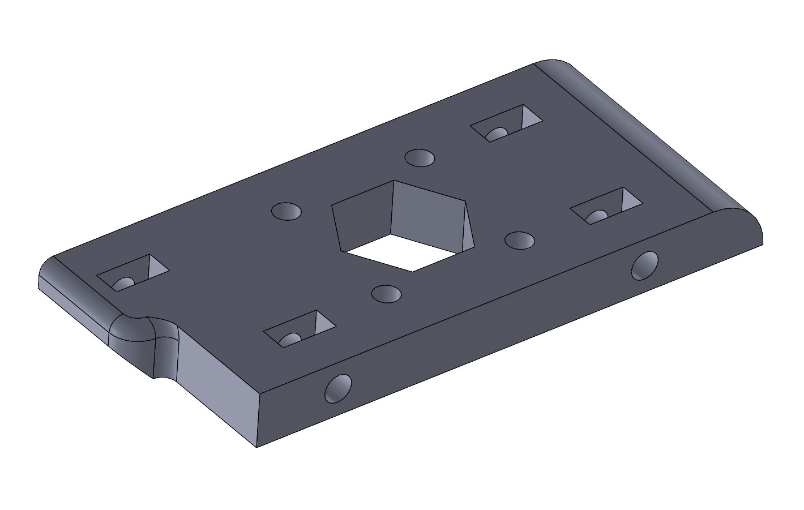
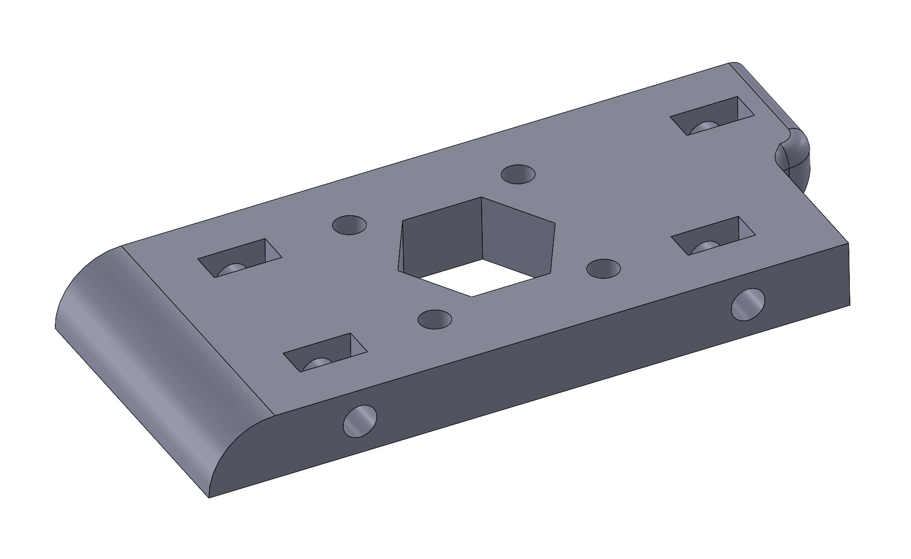
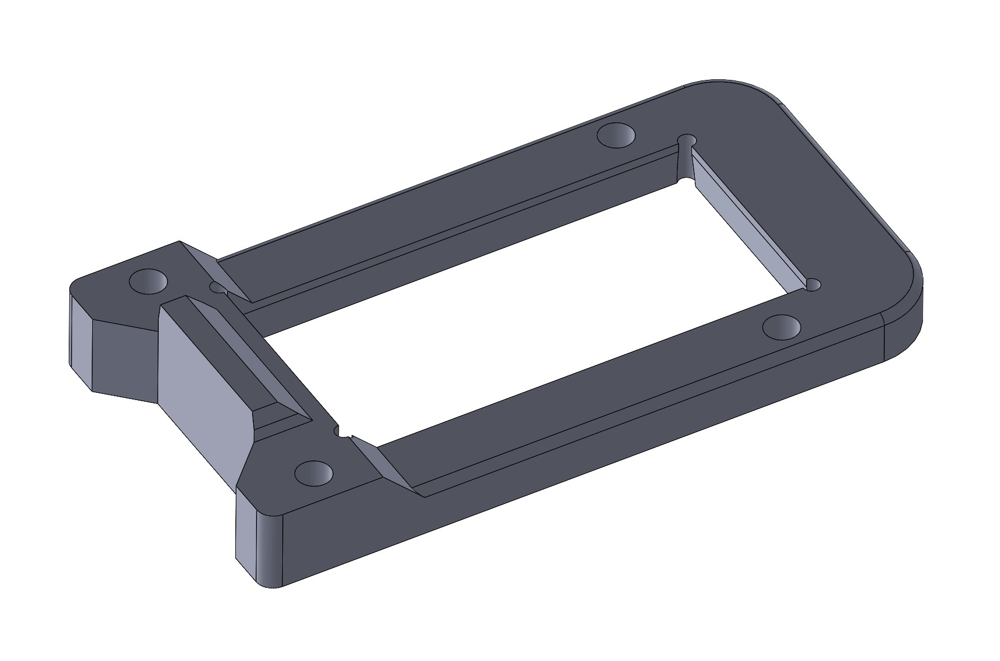
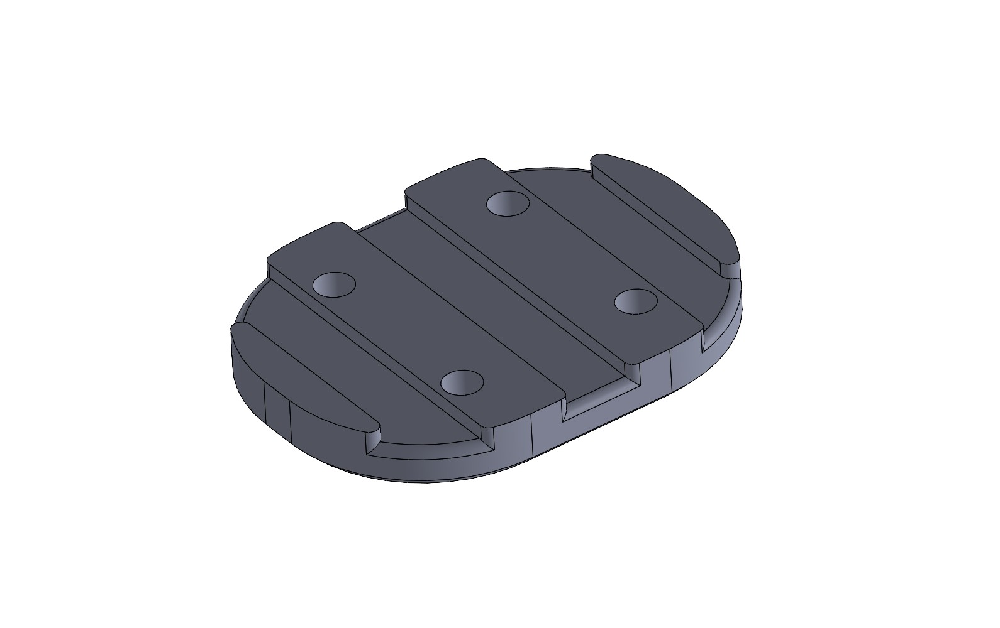

#  Hexapod

A 3D Printed Hexapod Robot

**This is the upgraded Hexapod v2 with stronger 21G servos, for the instructions of the original Hexapod with MG92B or MG90S servos, please go to [v1 branch](https://github.com/rookidroid/hexapod/tree/v1)**




## Introduction

This agile, 3D-printed hexapod robot is designed to work with either a Raspberry Pi PICO or an ESP32, providing flexibility and enhanced performance. Equipped with stronger and faster 21G servos, it offers a range of advanced features, including:

- A robust, durable structure
- WiFi-enabled remote control
- Smooth, agile movement
- Over-the-air (OTA) firmware updates for easy maintenance

## Electronics

| Name                 | Thumbnail                                                                                                                                                    | Required # | Note |
| -------------------- | ------------------------------------------------------------------------------------------------------------------------------------------------------------ | ---------- | ---- |
| Controller Board     |  or  | 1          |      |
| 21G Servo            |                                                                                           | 18         |      |
| Rocker Switch        |                                                                                                     | 1          |      |
| 18650 battery        |                                                                                                   | 2          |      |
| 18650 battery holder |                                                                                      | 1          |      |

### Connection Diagram

#### ESP32


#### Respberry Pi PICO W/2W


## Assembly


### 3D-Printed Parts

#### Body x 1


| Filename         | Thumbnail                                                                     | Required # |
| ---------------- | ----------------------------------------------------------------------------- | ---------- |
| body_base        |                | 1          |
| body_side        |                | 2          |
| body_front_back  |    | 2          |
| body_top         |                  | 1          |
| body_top_cover   |      | 1          |
| body_battery     |          | 1          |
| body_servo_side1 |  | 6          |
| body_servo_side2 |  | 6          |
| body_servo_top   |      | 6          |

#### Joint x 3 + Mirrored Joint x 3

_Check the images of the fully assembled robot for the orientations of the joints and the mirrored joints_


| Filename     | Thumbnail                                                             | Required # | Note |
| ------------ | --------------------------------------------------------------------- | ---------- | ---- |
| joint_bottom |  | 12         |      |
| joint_cross  |    | 6          |      |
| joint_top    |        | 12         |      |

#### Leg x 6


| Filename   | Thumbnail                                                         | Required # |
| ---------- | ----------------------------------------------------------------- | ---------- |
| leg_bottom |  | 6          |
| leg_side   |      | 12         |
| leg_top    |        | 6          |

#### Foot x 3 + Mirrored Foot x 3

_Check the images of the fully assembled robot for the orientations of the feet and the mirrored feet_


| Filename    | Thumbnail                                                           | Required # | Note |
| ----------- | ------------------------------------------------------------------- | ---------- | ---- |
| foot_bottom |  | 6          |      |
| foot_top    |        | 6          |      |
| foot_ground |  | 6          |      |
| foot_tip    |        | 6          |      |

#### Accessory

| Filename               | Thumbnail                                                                                 | Note |
| ---------------------- | ----------------------------------------------------------------------------------------- | ---- |
| accessory_cable_holder |  |      |

### Others

| Name      | Spec                                  | Required # |
| --------- | ------------------------------------- | ---------- |
| Screw     | M2 6mm                                | 36         |
| Screw     | M2 10mm                               | 198        |
| Nuts      | M2                                    | 234        |
| Pin (304) | M4 6mm                                | 18         |
| Bearing   | MR74-2RS (4mm ID, 7mm OD, 2.5mm Bore) | 18         |

## Software


### ESP32-Arduino

Source code is under `./hexapod_arduino`.

- `hexapod_arduino.ino`: Main Arduino sketch
- `config.h`: Configuration header. Change the configurations based on your servo connections
- `motion.h`: Automatically generated motion look-up-table using `path_tool'

### Android

_Working in progress_

### PC

_Working in progress_

## Calibration

Check the following image for the initial positions of all the leg joints while all the servos are at 90 deg.

Adjust the following two lines in in `config.h` to correct the installation offsets.

```c
static int left_offset_ticks[3][3] = {{-5, 10, 0}, {-15, 5, -20}, {20, -10, 10}};
static int right_offset_ticks[3][3] = {{20, -10, 0}, {-15, 0, -5}, {-10, 0, -20}};
```


