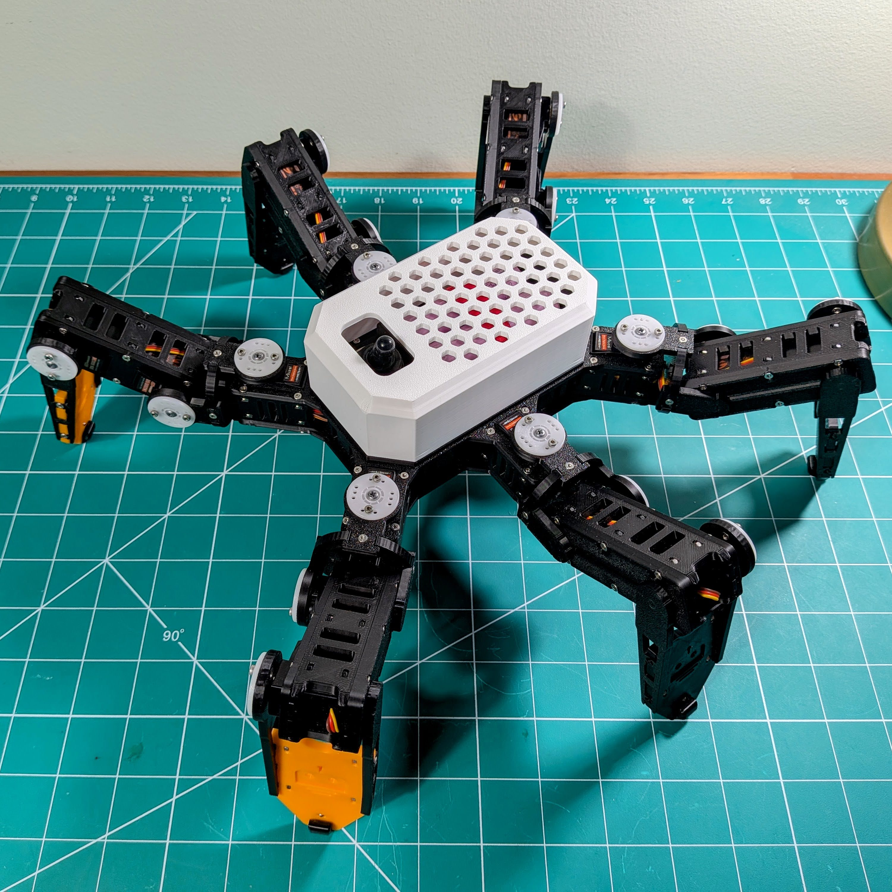
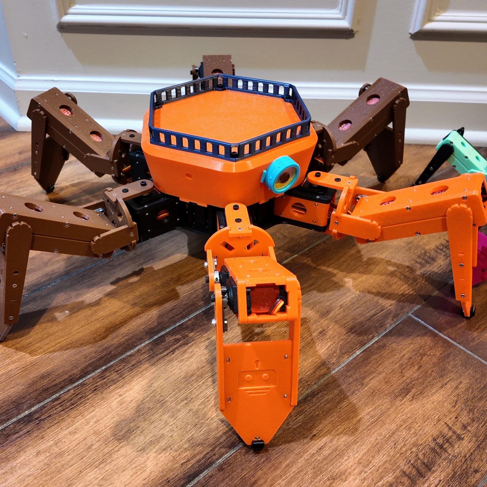

#  Hexapod

A family of 18-DOF, 3D-printed hexapod robots powered by an ESP32. Walk them from your phone over WiFi, or stream poses to them live from a computer. All the robots run the same firmware and gait generator. What differs is their frame, servos and dimensions.

[](./LICENSE)
[](https://www.espressif.com/en/products/socs/esp32)
[](https://rookidroid.com/)

## The Robots

| | [Nougat](./robots/nougat/) | [Mochi](./robots/mochi/) | [Macaroon](./robots/macaroon/) |
|---|---|---|---|
| |  |  |  |
| **Servos** | 18 × 21G digital | 18 × MG92B micro | 18 × 25 kg digital |
| **Battery** | 2 × 18650 (2S1P) | 2 × 18650 (2S) | 4 × 18650 (2S2P) |
| **Leg links** (coxa / femur / tibia) | 38 / 54 / 97 mm | 36 / 44 / 85 mm | 62 / 76 / 132 mm |
| **Controller** | ESP32 (Pico W legacy) | ESP32 (Pico W legacy) | ESP32 |
| **Firmware define** | `ROBOT_NOUGAT` | `ROBOT_MOCHI` | `ROBOT_MACAROON` |
| **WiFi SSID** | `hexapod_nougat` | `hexapod` | `hexapod_macaroon` |

Each robot's folder has its full build guide: bill of materials, 3D-printed parts, assembly, software setup, calibration and troubleshooting.

## Repository Layout

```text
hexapod/
├── robots/                 # Hardware for each robot
│   ├── nougat/             #   README (build guide), 3d print/, images/
│   ├── mochi/
│   └── macaroon/
├── images/                 # Images shared by all robots
└── software/
    ├── hexapod_esp32/      # ESP32 firmware (Arduino sketch), shared by all robots
    │   ├── robot.h         #   Pick the robot you are building here
    │   └── src/robots/     #   Per-robot settings and generated motion tables
    ├── hexapod_pico/       # Legacy Raspberry Pi Pico firmware (unmaintained)
    └── path_tool/          # Gait generator that produces the motion tables
        └── robots/         #   Per-robot geometry and gait parameters (JSON)
```

## Quick Start

1. Build the robot by following its guide in [`robots/`](./robots/).
2. Open [`software/hexapod_esp32/hexapod_esp32.ino`](./software/hexapod_esp32/hexapod_esp32.ino) in the Arduino IDE.
3. In [`robot.h`](./software/hexapod_esp32/robot.h), leave only your robot's `#define ROBOT_*` uncommented.
4. Upload, join the robot's WiFi network and calibrate it at `http://192.168.4.1`.

The [ESP32 firmware README](./software/hexapod_esp32/README.md) covers setup, the UDP protocol and OTA updates. The [path tool README](./software/path_tool/README.md) explains how the motion tables are generated and how to add a new robot.

## Earlier Versions

Each robot used to live on its own branch (`nougat`, `mochi`, `macaroon`), and the original design is on `v1`. Those branches are kept for reference and are no longer updated.

## License

[GPL-3.0](./LICENSE)

## Support

- Website: [rookidroid.com](https://rookidroid.com/)
- Issues: [GitHub Issues](https://github.com/rookidroid/hexapod/issues)
- E-mail: [info@rookidroid.com](mailto:info@rookidroid.com)
