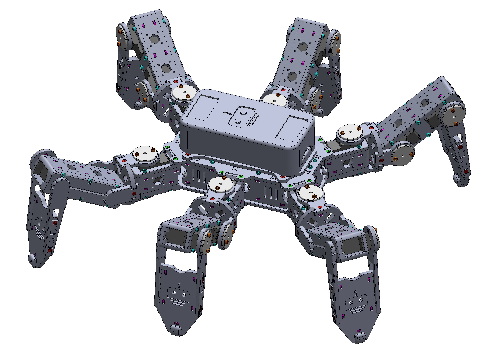

#  Hexapod

A 3D Printed Hexapod Robot

## Introduction

This agile, 3D-printed hexapod robot, built with ESP32 and Arduino, offers a range of advanced features, including:

- A robust, durable structure
- WiFi-enabled remote control
- Smooth, agile movement
- Over-the-air (OTA) firmware updates for easy maintenance

### Watch on Youtube

## Electronics

| Name                       | Thumbnail                                                                | Required          | Note      |
| -------------------------- | ------------------------------------------------------------------------ | ----------------- | --------- |
| ESP32 Dev Module           |                   | 1                 |           |
| MG92B or MG90S (metal gear)|                   | 18                | Can be mixed |
| PCA9685 servo driver       |               | 2                 | Need to be configured as different I2C addresss |
| XL4005 DC-DC step down     |                 | 2                 | 6V output |
| Mini 360 DC-DC step down   |               | 1                 | 5V output |
| Switch                     |                 | 1                 |           |
| 18650 battery              |               | 2                 |           |
| 18650 battery holder       |   | 1                 |           |

### Connection Diagram

## Mechanism

### Bill of Materials (BOM)

#### 3D-Printed Parts

##### Body x 1

| Filename       | Thumbnail                                                               | Required |
| -------------- | ----------------------------------------------------------------------- | -------- |
| body_top       |            | 1        |
| body_base      |          | 1        |
| body_side      |          | 2        |
| body_front_back| | 2        |
| body_battery   |      | 1        |
| body_servo_side1 |  | 6        |
| body_servo_side2 |  | 6        |
| body_servo_top   |      | 6        |

##### Joint x 6

| Filename        | Thumbnail                                                                   | Required | Note      |
| --------------- | --------------------------------------------------------------------------- | -------- | --------- |
| joint_bottom    |        | 12       |           |
| joint_cross     |          | 6        |           |
| joint_top_mg90s |  | 12       | For MG90S |
| joint_top_mg92b |  | 12       | For MG92B |

##### Leg x 6

| Filename        | Thumbnail                                                                   | Required |
| --------------- | --------------------------------------------------------------------------- | -------- |
| leg_bottom      |            | 6        |
| leg_side        |                | 12       |
| leg_top         |                  | 6        |

##### Foot x 6

| Filename        | Thumbnail                                                                   | Required | Note      |
| --------------- | --------------------------------------------------------------------------- | -------- | --------- |
| foot_bottom     |          | 6        |           |
| foot_ground     |          | 6        |           |
| foot_tip        |                | 6        |           |
| foot_top_mg90s  |    | 6        | For MG90S |
| foot_top_mg92b  |    | 6        | For MG92B |

##### Accessory

| Filename               | Thumbnail                                                                                 | Note             |
| ---------------------- | ----------------------------------------------------------------------------------------- | ---------------- |
| accessory_spacer_mg90s |  | Spacer for MG90S |
| accessory_cable_holder |  |                  |

#### Others

| Name      | Spec    | Required |
| --------- | ------- | -------- |
| Screw     | M2 6mm  | 36       |
| Screw     | M2 10mm | 198      |
| Nuts      | M2      | 234      |
| Pin (304) | M4 6mm  | 18       |
| Bearing   | MR74-2RS (4mm ID, 7mm OD, 2.5mm Bore) | 18 |

## Software

### ESP32-Arduino

Source code is under `./hexapod_arduino`.

- `hexapod_arduino.ino`: Main Arduino sketch
- `config.h`: Configuration header. Change the configurations based on your servo connections
- `motion.h`: Automatically generated motion look-up-table using `path_tool'

### Android

*Working in progress*

### PC

*Working in progress*
