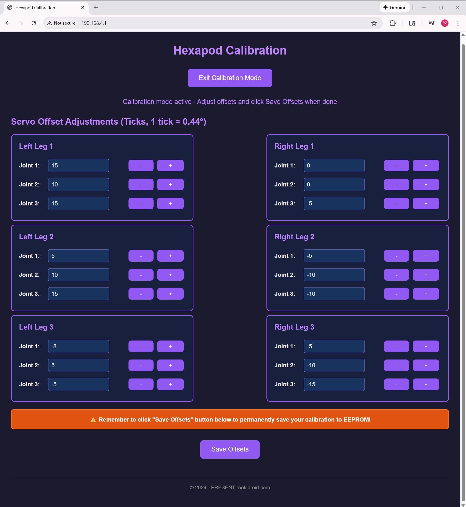

# Hexapod ESP32 Firmware

Arduino-based firmware for the ESP32-powered hexapod robot controller, shared by every robot in the family ([Nougat](../../robots/nougat/), [Mochi](../../robots/mochi/) and [Macaroon](../../robots/macaroon/)). Supports WiFi control via UDP commands, OTA updates, and 18-servo coordination through dual PCA9685 PWM drivers.

## Features

- **WiFi Control**: Access Point mode with UDP command interface
- **Web Calibration Interface**: Browser-based UI to adjust and save servo offsets to flash
- **Binary UDP Protocol**: Fast and efficient binary packet structure for motion control
- **18-Servo Control**: Dual PCA9685 PWM drivers (I2C) for coordinated leg movement
- **OTA Updates**: Wireless firmware updates over WiFi
- **Motion Library**: Pre-programmed gaits and movements
- **Non-blocking Motion Engine**: Gaits, streamed poses and every transition between them run from one tick-driven engine, so the web UI, OTA and failsafes stay responsive while walking
- **Event-Driven Boot**: Automatic boot sequence when client connects

## Hardware Requirements

- ESP32 Dev Module
- [Hexapod Controller Board (ESP32)](https://rookidroid.com/product/hexapod-controller-board-esp32/) - ESP32-based controller with dual PCA9685 PWM drivers
- 18× Servos (3 per leg × 6 legs)

## Dependencies

Install these libraries through Arduino Library Manager:

| Library | Purpose | Link |
|---------|---------|------|
| arduino-esp32 | ESP32 board support | [GitHub](https://github.com/espressif/arduino-esp32) |
| Adafruit_PWMServoDriver | PCA9685 control | [GitHub](https://github.com/adafruit/Adafruit-PWM-Servo-Driver-Library) |
| AsyncUDP | Non-blocking UDP | Included with arduino-esp32 |
| ArduinoOTA | OTA updates | Included with arduino-esp32 |
| Preferences | Calibration storage (NVS) | Included with arduino-esp32 |
| EEPROM | One-time import of older calibrations | Included with arduino-esp32 |
| WebServer | Calibration UI | Included with arduino-esp32 |

## Quick Start

### 1. Setup Arduino IDE

1. Install [Arduino IDE 2.x](https://www.arduino.cc/en/software)
2. Install ESP32 board support following [this guide](https://docs.espressif.com/projects/arduino-esp32/en/latest/installing.html)
3. Install required libraries via Library Manager (Sketch → Include Library → Manage Libraries)

### 2. Select Your Robot

Open `robot.h` and leave exactly one robot uncommented:

```cpp
// #define ROBOT_NOUGAT
// #define ROBOT_MOCHI
#define ROBOT_MACAROON
```

This picks the robot's motion tables and settings from `src/robots/<name>/`:

| Robot | `robot.h` define | WiFi SSID | `DELAY_MS` |
|-------|------------------|-----------|------------|
| Nougat | `ROBOT_NOUGAT` | `hexapod_nougat` | 12 |
| Mochi | `ROBOT_MOCHI` | `hexapod` | 12 |
| Macaroon | `ROBOT_MACAROON` | `hexapod_macaroon` | 25 |

`DELAY_MS` is the time between LUT frames. The frame period is now exactly
`DELAY_MS`: earlier firmware also spent ~10 ms per frame on a 100 kHz I2C bus,
so gaits play faster than before, most noticeably on Nougat and Mochi. Raise
`DELAY_MS` in `src/robots/<name>/robot_config.h` if a gait feels rushed.

With `arduino-cli`, you can pick the robot without editing the file:
`arduino-cli compile --fqbn esp32:esp32:esp32 --build-property "compiler.cpp.extra_flags=-DROBOT_MOCHI"`.

### 3. Configure Hardware

Edit `config.h` if your wiring or WiFi password differs:

```cpp
// Servo pin mappings
static int left_legs[3][3] = { { 1, 2, 3 }, { 5, 6, 7 }, { 9, 8, 10 } };
static int right_legs[3][3] = { { 10, 9, 8 }, { 13, 14, 15 }, { 7, 6, 5 } };

// WiFi password (the SSID is set per robot in src/robots/<name>/robot_config.h)
#define APPSK "hexapod_1234"
```

### 4. Upload Firmware

1. Connect ESP32 via USB
2. Select **Tools → Board → ESP32 Dev Module**
3. Select correct COM port
4. Click **Upload**
5. Monitor Serial output (115200 baud) for IP address

### 5. Control the Robot

1. Connect to the robot's WiFi network (see the table above, password: `hexapod_1234`)
2. Robot will automatically perform boot sequence when client connects
3. Send UDP commands to `192.168.4.1:1234`

## How to Calibrate

The firmware includes a web-based calibration interface to easily adjust servo offsets without recompiling code. These offsets are saved to the ESP32's flash (NVS). Calibrations saved by older firmware in EEPROM are imported automatically on first boot.



### Calibration Steps:

1. Power on the hexapod and connect your device to its WiFi network (see [Select Your Robot](#2-select-your-robot)).
2. Open a web browser and navigate to `http://192.168.4.1/`.
3. Click the **Enter Calibration Mode** button. The robot will move to its neutral calibration posture.
4. Use the `+` and `-` buttons for each joint on the web interface to fine-tune the positions. Offsets are limited to ±100 ticks.
   - The goal is to align the legs such that the coxa (shoulder) is parallel to the body, the femur (thigh) is horizontal, and the tibia (calf) is vertical.
   - Adjust the offsets until all legs are perfectly aligned and the robot stands evenly.
5. Once satisfied with the posture, click **Save Offsets**. This will permanently save the calibration values to flash.
6. Click **Exit Calibration Mode**. The robot eases back to its standby posture.

*Note: You no longer need to manually edit offsets in `config.h`. If you wish to backup your offsets, the web interface will print the configured arrays to the Serial Monitor when you click save.*

## UDP Command Reference

Three binary packet types share port 1234. The **first byte selects the
protocol**, so the firmware dispatches on the magic number before it checks the
length (the motion and session packets are both 6 bytes).

| Magic | Packet | Size | Purpose |
|-------|--------|------|---------|
| `0xA5` | Motion command | 6 or 7 B | Play one of the built-in gait LUTs, optionally at a set speed |
| `0xA6` | Real-time pose | 44 B | Stream raw servo positions for all 18 joints |
| `0xA7` | Session control | 6 B | Enter/leave real-time mode, relax, keep-alive |

All packets are little-endian and unpadded (`#pragma pack(1)`).

### Motion command (`0xA5`)

- **Byte 0**: Magic number (`0xA5`)
- **Byte 1**: Command ID (see enum below)
- **Bytes 2-5**: Sequence number (32-bit unsigned integer)
- **Byte 6** *(optional)*: Playback speed in percent (see [Motion speed](#motion-speed))

| Command ID | Action |
|------------|--------|
| 0 | Standby |
| 1 | Walk forward |
| 2 | Walk backward |
| 3-5 | Walk right (45°/90°/135°) |
| 6-8 | Walk left (45°/90°/135°) |
| 9-10 | Fast walk (forward/backward) |
| 11-12 | Rotate in place (left/right) |
| 13-14 | Climbing gait (forward/backward) |
| 15-17 | Body rotation (pitch/roll/yaw) |
| 18 | Body twist motion |

**Failsafe:** the robot returns to standby if no UDP packet arrives for 500 ms
(`MOTION_TIMEOUT_MS`), so keep resending the command while it should move.

Gaits change only at the start or midpoint of a cycle, and always pass through
the standby posture on the way to the next gait.

#### Motion speed

The 7-byte form appends a speed byte that sets how fast the gait LUTs play, as a
percentage of the robot's tuned frame rate (`DELAY_MS`). Values are clamped to
20-100 %; slower speeds stretch the frame period, so a gait at 50 % takes twice
as long per cycle. `0` leaves the speed unchanged, and the 6-byte form never
touches it. Only gait playback follows the speed: the transitions between gaits
keep their pace so the robot still stops promptly.

The speed starts at **60 %** after boot (`MOTION_SPEED_DEFAULT_PCT` in
`config.h`), so clients that only send the 6-byte form walk at 60 % unless the
speed is raised. It can also be set from the **Motion Speed** slider on the web
page at `http://192.168.4.1/`; a client sending 7-byte packets, such as the
[arcade remote](https://github.com/rookidroid/remote-arcade), overrides it with
every packet. The setting is not saved across reboots.

#### Example (Python)

```python
import socket
import struct

# 0xA5 (magic), 1 (Walk forward), 0 (sequence), 60 (speed %)
packet = struct.pack("<BBIB", 0xA5, 1, 0, 60)
sock = socket.socket(socket.AF_INET, socket.SOCK_DGRAM)
sock.sendto(packet, ("192.168.4.1", 1234))
```

### Real-time pose (`0xA6`)

Streams servo positions directly, bypassing the motion LUTs. Used by the
[hexapod-robot-simulator](https://github.com/rookidroid/hexapod-robot-simulator)
to drive the robot live, from a single joint up to a whole-body pose.

| Offset | Type | Field | Notes |
|--------|------|-------|-------|
| 0 | `uint8` | magic | `0xA6` |
| 1 | `uint8` | flags | bit 0: snap immediately instead of obeying the slew limit |
| 2 | `uint16` | max_step | Per-joint slew limit in ticks per 20 ms cycle (0 = default, 8) |
| 4 | `uint32` | seq_num | Sequence number |
| 8 | `int16[6][3]` | ticks | Servo ticks, leg-major |

Leg order matches the motion LUTs: right front, right middle, right back, left
front, left middle, left back. Joint order is coxa, femur, tibia. Ticks use the
same scale as the LUTs (`SERVOMIN` 102 … `SERVOMAX` 512, mid 307), before
calibration: the saved per-joint offset is added on the robot, exactly as it is
for LUT playback. Ticks are clamped on arrival to the window that stays within
`SERVOMIN`…`SERVOMAX` after that offset, so calibration never costs a joint any
travel.

Receiving a pose packet implicitly enters real-time mode from whatever posture
the robot holds, even mid-gait. Each control cycle every joint moves toward its
target by at most `max_step` ticks, so a large jump becomes a controlled slew
rather than a step input to 18 servos at once.

**Ordering:** UDP can reorder packets. A pose whose `seq_num` is up to 63 behind
the newest one received is dropped. A bigger step back is taken as a client
restart and accepted. The window resets on `RT_ENTER`.

**Failsafe:** if no packet arrives for 1 s the robot eases back to standby and
returns to LUT control. Send a keep-alive (below) while idle.

### Session control (`0xA7`)

| Offset | Type | Field |
|--------|------|-------|
| 0 | `uint8` | magic (`0xA7`) |
| 1 | `uint8` | action |
| 2 | `uint32` | seq_num |

| Action | Name | Effect |
|--------|------|--------|
| 0 | Exit | Leave real-time mode, resume LUT playback from standby |
| 1 | Enter | Enter real-time mode, holding the current posture |
| 2 | Relax | Disable both PWM drivers so the servos go limp; any motion command, pose or Enter wakes them |
| 3 | Ping | Keep-alive; resets the failsafe timer |

Sending a motion command (`0xA5`) also leaves real-time mode, so the two control
styles cannot fight over the servos.

#### Example (Python)

```python
import socket
import struct

sock = socket.socket(socket.AF_INET, socket.SOCK_DGRAM)
addr = ("192.168.4.1", 1234)

# Enter real-time mode
sock.sendto(struct.pack("<BBI", 0xA7, 1, 0), addr)

# Hold the standby posture (matches lut_standby)
ticks = [307, 239, 273] * 3 + [307, 375, 341] * 3
sock.sendto(struct.pack("<BBHI" + "h" * 18, 0xA6, 0, 8, 1, *ticks), addr)
```

> **Note:** packets are not echoed or logged to serial by default. Build with
> `HEXAPOD_DEBUG` set to 1 in `config.h` to log and echo motion and session
> packets. Pose packets are never logged: at 50 Hz the logging would saturate
> the serial port and stall the UDP task.

## Robot Config (HTTP)

`GET http://192.168.4.1/robot_config` describes the robot the firmware was built
for, so a client such as [Hexapod Link](https://github.com/rookidroid/hexapod-link)
can model and drive it without its own copy of every robot's config:

```json
{
  "protocol": 1,
  "name": "nougat",
  "ssid": "hexapod_nougat",
  "delay_ms": 12,
  "servo": {"min": 102, "mid": 307, "max": 512},
  "speed": {"min": 20, "max": 100, "default": 60, "current": 60},
  "commands": ["standby", "walk0", "walk180", "...", "twist"],
  "geometry": {"name": "nougat", "label": "Nougat", "legMountX": ["..."], "...": "..."}
}
```

- `protocol` is `PROTOCOL_VERSION` in `protocol.h`.
- `commands` lists the motion names in `RobotCommand` order: a name's index is
  the command ID for a `0xA5` packet.
- `geometry` is the robot's `software/path_tool/robots/<name>.json` (leg mounts,
  link lengths, `legScale`, postures, gait radii and joint limits), compiled in
  from `src/robots/<name>/robot_geometry.h`. After editing the JSON, refresh the
  header with `python generate_motion.py <name>` (or `--geometry-only` to leave
  the LUTs alone).

The other HTTP routes back the calibration page and the speed slider:

| Route | Method | Purpose |
| --- | --- | --- |
| `/enter_calibration` | GET | Enter calibration mode; returns the offsets |
| `/exit_calibration` | GET | Leave calibration mode |
| `/get_offsets` | GET | `{"left":[[..],[..],[..]],"right":[[..],[..],[..]]}` |
| `/set_offsets` | POST | Apply offsets (same JSON; calibration mode only, each clamped to +/-100) |
| `/save_offsets` | POST | Save the offsets to flash |
| `/get_speed` | GET | `{"speed":N}` |
| `/set_speed?pct=N` | POST | Set the LUT playback speed; returns `{"speed":N}` |

## OTA Updates

After initial USB upload, use OTA for wireless updates:

1. Power on robot and connect to its WiFi
2. In Arduino IDE: **Tools → Port → Network Ports**, then select `hexapod-<robot>` (e.g. `hexapod-macaroon`)
3. Upload as normal. The servos go limp while the new firmware is written
4. Note: OTA is disabled after the first motion command or real-time session (reboot to re-enable)

OTA has no password by default, so anyone who joins the robot's access point
can flash it. Define `OTA_PASSWORD` in `config.h` to require one.

## File Structure

```text
hexapod_esp32/
├── hexapod_esp32.ino    # setup() / loop() and the shared system state
├── motion_control.ino   # PWM drivers, motion engine, every write to a servo
├── realtime.ino         # Real-time pose streaming and its slew limiter
├── network.ino          # WiFi AP, OTA, UDP endpoint and packet parsing
├── calibration.ino      # Servo offsets loaded from / saved to flash (NVS)
├── web_ui.ino           # HTTP routes: calibration, speed, /robot_config
├── hexapod.h            # Shared state and module interfaces
├── protocol.h           # UDP packet layouts and magic numbers
├── web_page.h           # Calibration page served from flash
├── config.h             # Hardware config, pin mappings, calibration
├── robot.h              # Selects the robot the firmware is built for
├── motion.h             # Includes the selected robot's motion tables
├── robot_geometry.h     # Includes the selected robot's geometry JSON
├── src/robots/<name>/
│   ├── robot_config.h   # Robot-specific settings (WiFi SSID, DELAY_MS)
│   ├── robot_geometry.h # Geometry served at /robot_config (generated by path_tool)
│   └── motion.h         # Motion lookup tables (generated by path_tool)
└── README.md            # This file
```

The `.ino` files are Arduino sketch tabs: the build concatenates them into one
translation unit, so the `static` tables in `config.h` and `motion.h` exist once
and every module sees the same calibration offsets. Types used in function
signatures belong in `hexapod.h`, because the build hoists each tab's function
prototypes above that tab's own declarations.

Only the main loop writes to the servos. The UDP task records requests
(`next_motion_idx`, `realtime_mode`, `relax_requested`, the streamed pose) and
`serviceMotionEngine()` acts on them at its next tick, starting every transition
from `pose_current`, the pose last written to the servos.

## Configuration Parameters

Key constants in `config.h`:

```cpp
// Servo timing (DELAY_MS, the delay between LUT steps, is per robot in robot_config.h)
const uint16_t SERVO_INIT_DELAY_MS = 50;    // Boot sequence delay
const uint8_t TRANSITION_TICK_STEP = 6;      // Transition smoothness
#define MOTION_TIMEOUT_MS 500                // LUT failsafe
#define REALTIME_TIMEOUT_MS 1000             // Real-time failsafe

// Hardware
const uint8_t LEFT_PWM_ADDRESS = 0x40;       // Left PCA9685 I2C address
const uint8_t RIGHT_PWM_ADDRESS = 0x41;      // Right PCA9685 I2C address
const uint8_t LEFT_PWM_ENABLE_PIN = 19;      // Left driver enable (active LOW)
const uint8_t RIGHT_PWM_ENABLE_PIN = 26;     // Right driver enable (active LOW)
const uint32_t I2C_CLOCK_HZ = 400000;        // I2C bus speed
const uint32_t PCA9685_OSC_HZ = 25000000;    // Tune if servo angles are off

// Calibration
const int CALIBRATION_MAX_OFFSET = 100;      // Largest accepted offset (ticks)
```

## Troubleshooting

### WiFi connection issues

- Verify the SSID in `src/robots/<name>/robot_config.h` and the password in `config.h`
- Check serial monitor for IP address (192.168.4.1 default)
- Ensure client device supports 2.4GHz WiFi

### Servos not moving

- Check PWM driver I2C addresses match hardware (0x40, 0x41)
- Verify enable pins are connected correctly (active LOW)
- Confirm servo pin mappings in `config.h`
- Test individual servos with `posture_calibration()` function

### OTA not visible

- OTA only works before first motion command
- Reboot robot to re-enable OTA
- Ensure connected to robot's WiFi network
- Check firewall settings on upload computer

## Adding Custom Motions

1. Add the path to `gen_luts()` in [`../path_tool/generate_motion.py`](../path_tool/generate_motion.py) so it is generated for every robot
2. Regenerate the LUTs with `python generate_motion.py --all`, which rewrites each `src/robots/<name>/motion.h`
3. Add a command ID before `CMD_COUNT` in `protocol.h`, then the matching entry at the same position in `motion_config[]` in `motion_control.ino` (a `static_assert` checks the counts match):

```cpp
const MotionConfig motion_config[] = {
  // ... existing motions ...
  { "mymotion", lut_mymotion_length, lut_mymotion }
};
```

## License

Copyright (C) 2024 - PRESENT rookidroid.com

## Support

- Website: [rookidroid.com](https://rookidroid.com/)
- Email: [info@rookidroid.com](mailto:info@rookidroid.com)
